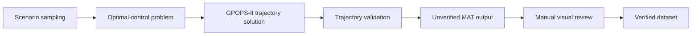
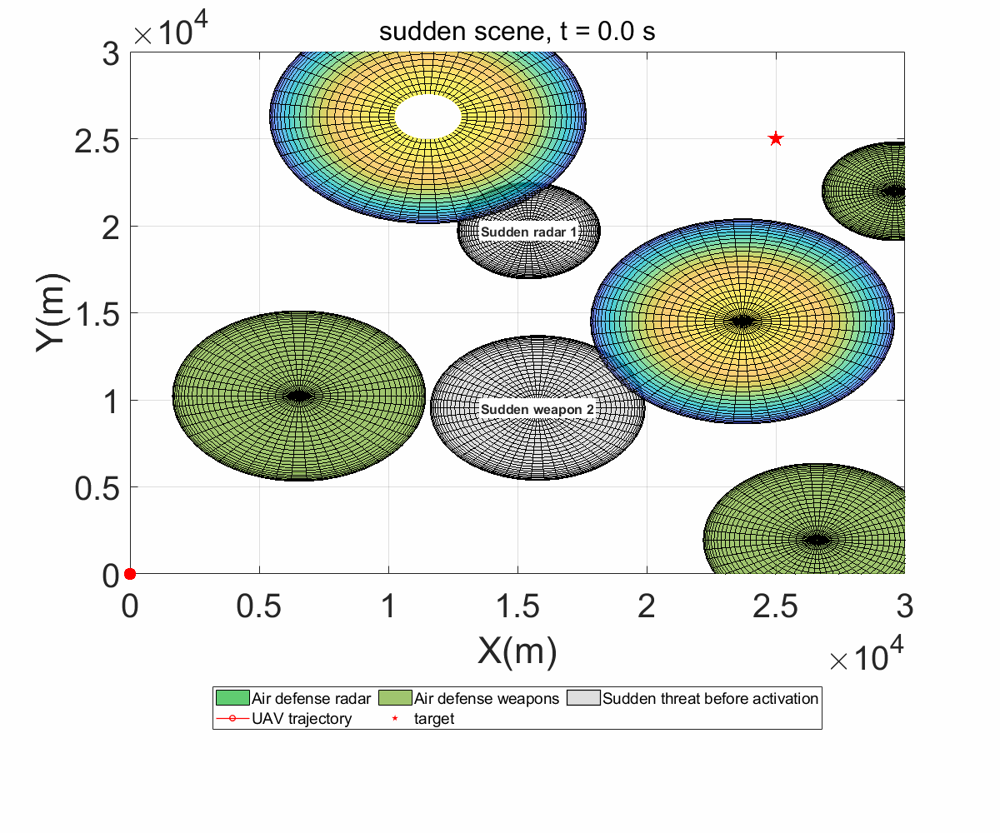
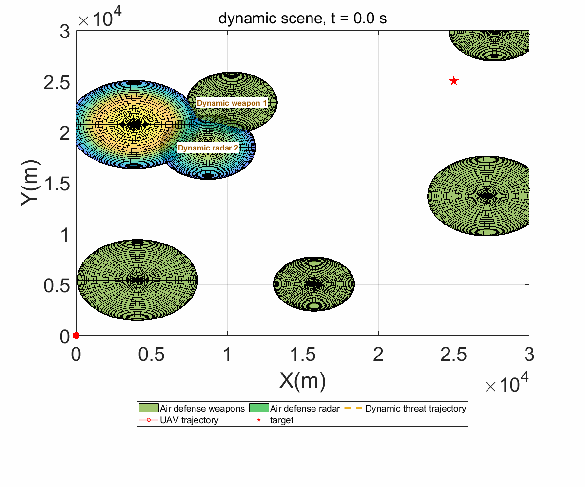
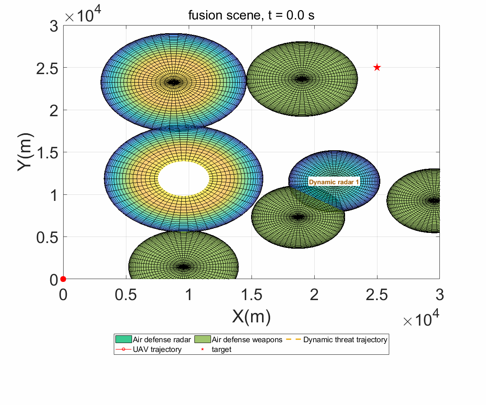

# MIST-GNN UAV Penetration Trajectory Dataset

This repository provides the dataset generation code for UAV ground-penetration trajectory scenarios used in the MIST-GNN study. The dataset is generated from optimal-control trajectory planning in randomly sampled air-defense environments, and each sample contains the UAV state sequence, target trajectory, threat configuration, dynamic threat states, radar detection probability, and validation metadata.

The generator is designed to produce diverse but physically constrained penetration scenarios, including static air-defense scenes, moving time-sensitive targets, sudden threats, moving dynamic threats, and fused scenes.

## Dataset Overview

Each trajectory sample is stored as a MATLAB `.mat` file named `trajectory_data_<index>.mat`. A sample corresponds to one complete UAV penetration process from the start point to the target region.

| Scenario | Directory | Default Index Range | Description |
| --- | --- | ---: | --- |
| Static penetration | `static` | `1-10000` | Static target with randomly distributed static radar and weapon threats. |
| Time-sensitive target | `time_sensitive` | `10001-20000` | The target moves with random speed and direction; the final target position is kept outside active weapon coverage. |
| Sudden threat | `sudden` | `20001-30000` | One or two hidden radar/weapon threats are activated after the UAV reaches the trigger condition. |
| Dynamic threat | `dynamic` | `30001-40000` | One or two radar/weapon threats move toward predicted intercept points after distance or time activation. |
| Fusion scenario | `fusion` | `40001-50000` | A randomized combination of moving targets, sudden threats, and dynamic threats. |

Validated data can be placed in `data/dataset`. Newly generated data are written to `data/unverified_dataset/<scenario>` by default, so generated samples do not overwrite manually validated data. The manual review tool moves accepted samples into `data/dataset/<scenario>`.

The dataset release is being updated progressively. The committed files in `data/dataset` should be treated as the currently available validated subset, while the generation pipeline in `data_create` is the reproducible interface for extending the dataset to the full planned scale.

## Scenario Design

The environment is a 30 km by 30 km ground plane. Threats are represented as hemispherical coverage regions:

- `circleClass = 0`: air-defense radar.
- `circleClass = 1`: air-defense weapon.
- Weapon coverage is treated as a hard no-entry constraint.
- Radar coverage is treated as a soft exposure cost through the radar detection probability `Pt`.

The generator samples threat number, position, radius, class, and special-threat behavior under validity constraints. In particular, the UAV start area is kept clear, the target terminal point is protected from weapon coverage, and generated trajectories are checked before being saved.

## Generation Workflow



The main reproduction entry is:

```matlab
data_create/generate_mist_gnn_dataset.m
```

It calls the lower-level scenario generator and trajectory solver for the selected scene types.

## Requirements

- MATLAB R2022a or a compatible MATLAB version.
- GPOPS-II installed and available on the MATLAB path.
- A supported NLP solver for GPOPS-II, such as SNOPT or IPOPT.

The repository expects `gpops2/` to be available locally when solving trajectories. Third-party toolboxes and solver binaries should be handled according to their own licenses.

## Reproducing the Dataset

Add the generator folder to the MATLAB path:

```matlab
addpath('data_create');
```

Generate a small preview dataset:

```matlab
files = generate_mist_gnn_dataset( ...
    "numSamplesPerScenario", 2, ...
    "seed", 20260606);
```

Generate the full five-scenario dataset:

```matlab
files = generate_mist_gnn_dataset( ...
    "numSamplesPerScenario", 10000, ...
    "seed", 20260606, ...
    "maxAttempts", 20, ...
    "terminalTolerance", 50, ...
    "nlpSolver", "snopt");
```

Generate only one scenario type:

```matlab
files = generate_mist_gnn_dataset( ...
    "scenarioTypes", "dynamic", ...
    "numSamplesPerScenario", 10000, ...
    "startIndices", 30001, ...
    "seed", 20260606);
```

The `scenarioTypes` argument accepts `"static"`, `"time_sensitive"`, `"sudden"`, `"dynamic"`, `"fusion"`, or a string array containing several of them.

## Scenario Parameters

Common generation parameters:

| Parameter | Meaning |
| --- | --- |
| `scenarioTypes` | Scenario type or list of scenario types to generate. |
| `numSamplesPerScenario` | Number of samples generated for each selected scenario. |
| `startIndices` | First output index for each selected scenario. |
| `outputRoot` | Output root directory, default `data/unverified_dataset`. |
| `seed` | Random seed for reproducible scene sampling. |
| `maxAttempts` | Maximum regeneration attempts for each sample before skipping it. |
| `terminalTolerance` | Allowed final distance between the UAV and the target endpoint. |
| `nlpSolver` | NLP solver used by GPOPS-II, for example `"snopt"` or `"ipopt"`. |

Selected behavior parameters:

| Parameter | Meaning |
| --- | --- |
| `targetSpeedRange` | Random speed range for moving targets. |
| `targetHeadingRange` | Random heading range for moving targets. |
| `numSuddenThreats` | Number of sudden threats; can be `1`, `2`, or `"random"`. |
| `suddenThreatClassMode` | Sudden threat class mode: `"random"`, `"radar"`, `"weapon"`, or `"mixed"`. |
| `suddenTriggerDistanceRange` | Distance threshold range for sudden-threat activation. |
| `numDynamicThreats` | Number of dynamic threats; can be `1`, `2`, or `"random"`. |
| `dynamicThreatClassMode` | Dynamic threat class mode: `"random"`, `"radar"`, `"weapon"`, or `"mixed"`. |
| `dynamicThreatSpeedRange` | Fixed random speed range for dynamic threats. |
| `dynamicResponseDistanceRange` | Distance threshold for dynamic-threat activation. |
| `dynamicMoveStartRange` | Latest time threshold for dynamic-threat activation. |

For dynamic threats, `[180,250] m/s` is a balanced speed range for large-scale generation. A lower range such as `[150,250] m/s` usually improves feasibility, while a higher range such as `[220,300] m/s` emphasizes stronger intercept behavior.

More detailed parameter descriptions are provided in [data_create/README_dataset_generation.md](data_create/README_dataset_generation.md).

## Manual Dataset Review

Generated samples should be checked before they are treated as verified data. Start the review window with:

```matlab
addpath('data_create');
review_penetration_dataset( ...
    "unverifiedRoot", "data/unverified_dataset", ...
    "datasetRoot", "data/dataset");
```

The review window supports:

- selecting a dataset folder, scenario type, and individual `.mat` sample;
- inspecting the scene in an embedded interactive Figure panel;
- generating an embedded GIF preview in the same window without writing preview files to the sample directory;
- confirming a sample and moving it to `data/dataset/<scenario>`;
- deleting an invalid sample;
- regenerating a sample with the same index using adjustable solver and scenario parameters;
- automatically loading the next sample after approval or deletion;
- renumbering all `trajectory_data_*.mat` files in a selected scenario folder;
- showing the current operation state in the lower-right status panel and temporarily disabling major controls during long operations such as regeneration.

The same operations can also be called from scripts:

```matlab
dataset_review_action("approve", ...
    "data/unverified_dataset/static/trajectory_data_1.mat", ...
    "datasetRoot", "data/dataset");

dataset_review_action("delete", ...
    "data/unverified_dataset/static/trajectory_data_2.mat");

dataset_review_action("regenerate", ...
    "data/unverified_dataset/dynamic/trajectory_data_30001.mat", ...
    "regenerateOptions", {"maxAttempts", 20, "dynamicThreatSpeedRange", [180, 250]});

renumber_penetration_dataset("data/unverified_dataset/static");
renumber_penetration_dataset("data/dataset/static");
```

## MAT File Structure

Each output file stores one `trajectory_data` structure. Main fields include:

| Field | Description |
| --- | --- |
| `aircraft_position_x`, `aircraft_position_y`, `aircraft_position_z` | UAV position sequence. |
| `v`, `theta`, `phi` | UAV speed, heading angle, and flight-path angle. |
| `nx`, `nz`, `gama` | UAV control sequence. |
| `time` | Time stamps of the trajectory. |
| `xt`, `yt`, `zt` | Target position sequence. |
| `vt`, `thetat` | Target speed and heading sequence. |
| `D` | Distance between UAV and target over time. |
| `Pt` | Radar detection probability sequence. |
| `circleCenters`, `circleRadii`, `circleClass` | Initial threat centers, threat radii, and threat classes. |
| `circleCentersDynamic` | Time-varying threat centers for dynamic scenes. |
| `threatActive` | Threat activation state at each time step. |
| `threatTrajectory` | Threat trajectory metadata used for visualization and analysis. |
| `scenarioType`, `scenarioConfig` | Scenario label and full scenario configuration. |
| `validationReport` | Terminal, weapon-avoidance, and scene-validity checks. |

## Validation Rules

A trajectory is saved only after passing the built-in validity checks:

- The UAV terminal position is within the target tolerance.
- The UAV does not enter any active weapon coverage region.
- The final target position does not fall inside active weapon coverage.
- The UAV start area is not covered by initial threats.
- State and target sequences contain finite numeric values.

If a sampled scene or solved trajectory fails validation, the generator resamples and resolves that sample until `maxAttempts` is reached.

## Visualization

Static scene or final-frame visualization:

```matlab
plot_penetration_scene(files(1), ...
    "showFigure", true, ...
    "saveOutput", true);
```

Dynamic GIF visualization:

```matlab
plot_penetration_scene("data/unverified_dataset/dynamic/trajectory_data_30001.mat", ...
    "showFigure", true, ...
    "saveOutput", true, ...
    "frameStep", 5);
```

Variable-level analysis:

```matlab
plot_mat_variables("data/unverified_dataset/dynamic/trajectory_data_30001.mat", ...
    "showFigure", true, ...
    "saveOutput", true);
```

The scene renderer uses class-specific threat colors, UAV trajectory traces, target markers, sudden-threat activation marks, and dynamic-threat motion traces. For moving scenes, GIF output shows UAV flight history, target movement, sudden threat activation, and dynamic threat movement.

## Behavior Showcase

The `behavior_showcase` samples illustrate the most important non-static behaviors used in the dataset: sudden-threat activation, dynamic-threat interception, and fused multi-factor scenes.

| Sudden threat | Dynamic threat | Fusion scenario |
| --- | --- | --- |
|  |  |  |

These GIFs are demonstration samples. The full dataset can be regenerated with the commands above and then reviewed with the manual review GUI before being moved into `data/dataset`.

## Repository Layout

```text
MIST-GNN/
|-- data/
|   |-- dataset/                 # Manually validated dataset files
|   `-- unverified_dataset/      # Generated dataset files
|-- data_create/
|   |-- generate_mist_gnn_dataset.m
|   |-- generate_penetration_dataset.m
|   |-- review_penetration_dataset.m
|   |-- dataset_review_action.m
|   |-- renumber_penetration_dataset.m
|   |-- build_penetration_scenario.m
|   |-- validate_penetration_trajectory.m
|   |-- plot_penetration_scene.m
|   |-- render_penetration_scene_gif_html.m
|   `-- plot_mat_variables.m
|-- document/
|   `-- penetration trajectory reference document
`-- README.md
```

## Citation

If this dataset generation code is used in academic work, please cite the corresponding MIST-GNN paper and reference this repository.
